# Programa Estadístico

Este es un programa de análisis estadístico con interfaz gráfica desarrollado en Python. Permite cargar datos, realizar análisis estadísticos descriptivos y generar visualizaciones.

## Características

- Carga de datos desde archivos CSV y Excel
- Detección automática de tipos de variables (cuantitativa/cualitativa)
- Cálculo de estadísticas descriptivas
- Generación de gráficos estadísticos
- Interfaz gráfica intuitiva
- Agrupación inteligente de variables cualitativas usando IA (Gemini)
- Formateo mejorado de frecuencias y resultados estadísticos
- Ajuste automático y manual de funciones polinómicas entre dos columnas numéricas
- Recomendación de modelo/fórmula matemática usando IA (Gemini) para relaciones entre columnas
- Análisis algebraico automático de la función ajustada (dominio, rango, puntos críticos, etc.)
- Exportación de análisis y sugerencias de IA a archivos Markdown

## Requisitos

- Python 3.8 o superior
- Dependencias listadas en `requirements.txt`
- Conexión a internet para usar la funcionalidad de agrupación con IA
- Archivo `.env` con la clave API de Gemini (GEMINI_API_KEY)

## Instalación

1. Clonar el repositorio
2. Crear un entorno virtual (recomendado):
   ```bash
   python -m venv venv
   source venv/bin/activate  # En Windows: venv\Scripts\activate
   ```
3. Instalar dependencias:
   ```bash
   pip install -r requirements.txt
   ```
4. Crear archivo `.env` en la raíz del proyecto con tu clave API de Gemini:
   ```
   GEMINI_API_KEY=tu_clave_api_aqui
   ```

## Uso

Para ejecutar el programa:

```bash
python -m src.main
```

## Guía paso a paso

### 1. Iniciar el programa
Ejecuta el comando anterior y se abrirá la ventana principal del programa.

### 2. Cargar datos
- Haz clic en **Cargar CSV** o **Cargar Excel** para seleccionar tu archivo de datos.
- También puedes usar **Ingreso Manual** para introducir datos desde cero.

### 3. Detección y revisión de tipos de variables
- El programa detecta automáticamente si cada columna es **Cuantitativa** (números) o **Cualitativa** (categorías).
- Puedes revisar y corregir los tipos haciendo clic en **Revisar Tipos de Variables**.

### 4. Seleccionar columna para análisis
- Usa el menú desplegable "Columna" para elegir la variable que deseas analizar.
- Para variables cualitativas, puedes usar diferentes métodos de agrupación:
  - Por iniciales (A-B, C-D, etc.)
  - Por frecuencia (valores más comunes)
  - Por similitud (valores similares)
  - Por IA (Gemini) - Requiere conexión a internet
  - Personalizado (agrupación manual)

### 5. Análisis y visualización
- **Datos:** Si la variable es cuantitativa, puedes agrupar en intervalos usando la regla de Sturges o configurando manualmente.
- **Ver Distribución de Frecuencias:** Muestra la tabla de frecuencias con formato mejorado (absoluta, relativa, acumulada, etc.).
- **Medidas de Tendencia y Dispersión:**
  - Si la variable es cuantitativa, verás media, mediana, moda, rango, varianza, desviación estándar y coeficiente de variación.
  - Si es cualitativa, solo se muestra la moda (valor más frecuente).
- **Histograma:** Muestra el histograma de frecuencias para variables cuantitativas.
- **Polígono de Frecuencia:** Muestra el polígono de frecuencias para variables cuantitativas agrupadas.
- **Diagrama de Pastel:** Muestra un gráfico de pastel para variables cualitativas.

### 6. Interpretación
- Las tablas y gráficos se muestran en la interfaz o en ventanas emergentes.
- Puedes revisar los resultados y, si lo deseas, exportar los datos o gráficos (opcional, según versión).

### 7. Corrección y nuevo análisis
- Puedes volver a cargar datos, cambiar tipos de variables o seleccionar otra columna para repetir el análisis.

### 8. Crear función entre columnas
- Haz clic en **Crear función entre columnas**.
- Selecciona dos columnas numéricas (X e Y).
- Elige ajuste automático (mejor grado) o manual (grado polinómico).
- Visualiza y edita la función ajustada, la tabla de valores y el análisis algebraico.
- Haz clic en **Sugerir modelo con IA** para obtener una recomendación de Gemini.
- Guarda el análisis y la sugerencia en Markdown.
- Puedes graficar los datos y la función ajustada.

## Ejemplos visuales

A continuación se muestran ejemplos de la interfaz y de los gráficos generados por el programa:

### Interfaz principal
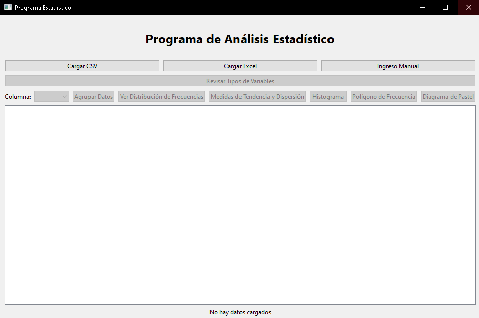

### Histograma
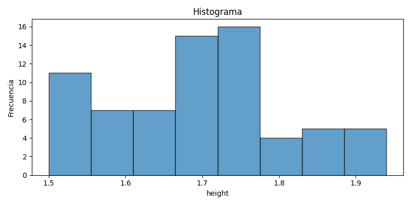

### Polígono de frecuencia
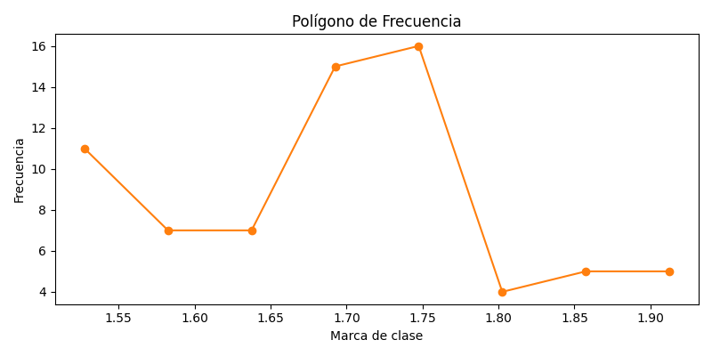

### Diagrama de pastel
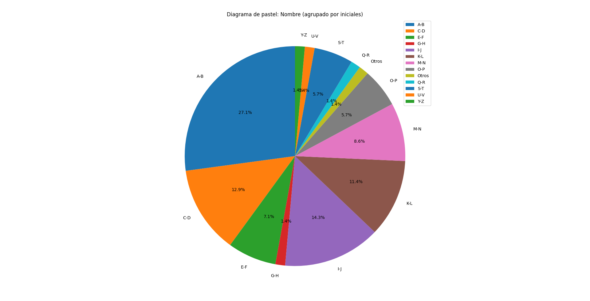

### Tabla de frecuencias
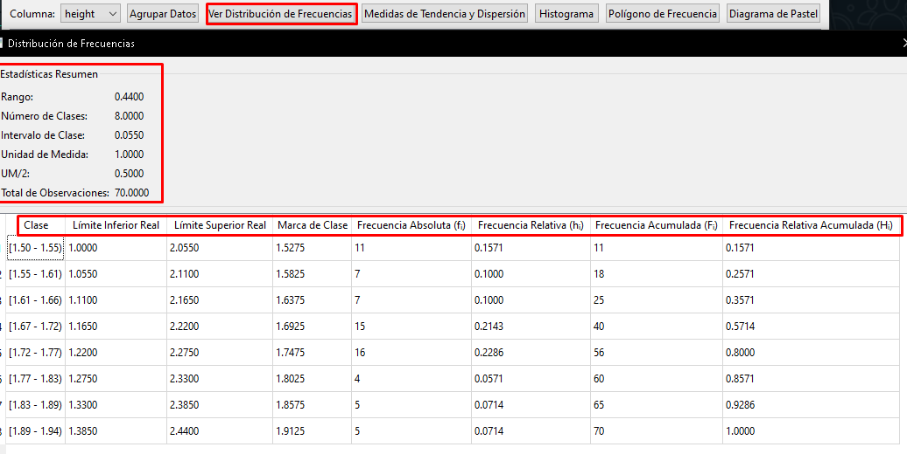

> **Nota:** Si no ves las imágenes, colócalas en la carpeta `docs/` con los nombres indicados o reemplaza por tus propios ejemplos.

## Fórmulas y métodos de cálculo

A continuación se detallan las fórmulas y métodos utilizados para cada estadístico y gráfico:

### Tipos de variable
- **Cuantitativa:** Variable numérica (discreta o continua).
- **Cualitativa:** Variable categórica (nominal u ordinal).

### Medidas de tendencia central y dispersión
- **Media aritmética:**
  - Fórmula: $\bar{x} = \frac{1}{N} \sum_{i=1}^N x_i$
  - Pandas: `df['col'].mean()`
  - [Referencia](https://es.wikipedia.org/wiki/Media_aritm%C3%A9tica)
- **Mediana:**
  - Valor central de la muestra ordenada.
  - Pandas: `df['col'].median()`
  - [Referencia](https://es.wikipedia.org/wiki/Mediana)
- **Moda:**
  - Valor que ocurre con mayor frecuencia.
  - Pandas: `df['col'].mode()`
  - [Referencia](https://es.wikipedia.org/wiki/Moda_(estad%C3%ADstica))
- **Rango:**
  - Fórmula: $R = \max(x_i) - \min(x_i)$
  - Pandas: `df['col'].max() - df['col'].min()`
  - [Referencia](https://es.wikipedia.org/wiki/Rango_(estad%C3%ADstica))
- **Varianza (muestral):**
  - Fórmula: $s^2 = \frac{1}{N-1} \sum (x_i - \bar{x})^2$
  - Pandas: `df['col'].var()`
  - [Referencia](https://es.wikipedia.org/wiki/Varianza)
- **Desviación estándar:**
  - Fórmula: $s = \sqrt{\text{varianza}}$
  - Pandas: `df['col'].std()`
  - [Referencia](https://es.wikipedia.org/wiki/Desviaci%C3%B3n_t%C3%ADpica)
- **Coeficiente de variación:**
  - Fórmula: $CV = \frac{s}{|\bar{x}|} \times 100\%$
  - [Referencia](https://economipedia.com/definiciones/coeficiente-de-variacion.html)

### Distribución de frecuencias
- **Frecuencia absoluta (fᵢ):** Número de observaciones en cada clase.
- **Frecuencia relativa (hᵢ):** $h_i = \frac{f_i}{N}$
- **Frecuencia acumulada (Fᵢ):** Suma acumulativa de frecuencias absolutas.
- **Frecuencia relativa acumulada (Hᵢ):** Suma acumulativa de frecuencias relativas.
- **Intervalos de clase:** Calculados usando la regla de Sturges: $k = 1 + 3.322 \log_{10}(N)$
- **Límites reales:** Se ajustan sumando/restando la mitad de la unidad de medida.
- **Marca de clase:** Punto medio de cada intervalo.
- **Método:** Se usa `pd.cut` y `value_counts` para  y contar.

### Gráficos
- **Histograma:**
  - `matplotlib.pyplot.hist(datos, bins=k)`
  - Eje X: intervalos de clase, Eje Y: frecuencia absoluta.
- **Polígono de frecuencia:**
  - `matplotlib.pyplot.plot(marcas_clase, frecuencias, marker='o')`
  - Se cierra al eje horizontal añadiendo 0 en los extremos.
- **Diagrama de pastel:**
  - `matplotlib.pyplot.pie(frecuencias, labels=etiquetas, autopct='%1.1f%%')`
  - Solo para variables cualitativas.

## Estructura del Proyecto

```
.
├── src/
│   ├── models/      # Modelos de datos
│   ├── views/       # Interfaces gráficas
│   ├── controllers/ # Controladores
│   └── utils/       # Utilidades
├── requirements.txt
├── README.md
├── .env            # Archivo de configuración para API keys
└── docs/           # Imágenes de ejemplo
```

## Licencia

Este proyecto está bajo la Licencia MIT.

## Ejemplo de interpretación de resultados

Supón que analizas la columna "height" de un grupo de estudiantes:
- **Media:** 165.2 cm. Indica la estatura promedio del grupo.
- **Mediana:** 165 cm. La mitad de los estudiantes mide menos y la otra mitad más de 165 cm.
- **Moda:** 165 cm. Es la estatura más frecuente.
- **Rango:** 10 cm. La diferencia entre el más alto y el más bajo.
- **Varianza y desviación estándar:** Indican cuán dispersas están las estaturas respecto a la media.
- **Coeficiente de variación:** Si es bajo, las estaturas son homogéneas; si es alto, hay mucha variabilidad.
- **Histograma:** Permite ver si la distribución es simétrica, sesgada, bimodal, etc.
- **Diagrama de pastel:** Si analizas una variable cualitativa como "color favorito", verás la proporción de cada categoría.

**Interpretación:**
- Si la media y la mediana son similares, la distribución es simétrica.
- Si la moda es muy diferente, puede haber valores atípicos o agrupaciones.
- Un rango pequeño y desviación baja indican poca variabilidad.
- El histograma ayuda a identificar patrones o anomalías visualmente.

## Recomendaciones de uso
- Antes de analizar, revisa y corrige los tipos de variable.
- Usa la agrupación solo para variables cuantitativas con muchos valores diferentes.
- Interpreta los resultados considerando el contexto de los datos.
- Usa los gráficos para comunicar hallazgos de forma visual.
- Si tienes dudas sobre una medida, consulta la referencia incluida en la interfaz.
- Exporta o guarda los resultados para documentar tu análisis.

## Pseudocódigo detallado del funcionamiento principal

```pseudocode
Algoritmo AnalisisEstadistico
    Iniciar programa
    Mostrar ventana principal
    Mientras el usuario no cierre la aplicación hacer
        Esperar acción del usuario
        Si el usuario carga datos entonces
            Detectar tipo de variable (cuantitativa/cualitativa)
            Mostrar datos en tabla
            Permitir revisión/corrección de tipos
        FinSi
        Si el usuario selecciona una columna entonces
            Si la columna es cuantitativa entonces
                Permitir agrupación, frecuencias, todas las medidas, histogramas, polígonos
                Calcular y mostrar:
                    - Tabla de frecuencias con formato mejorado:
                        * Frecuencia absoluta (fᵢ)
                        * Frecuencia relativa (hᵢ) con formato decimal y porcentaje
                        * Frecuencia acumulada (Fᵢ)
                        * Frecuencia relativa acumulada (Hᵢ) con formato decimal y porcentaje
                    - Medidas de tendencia y dispersión:
                        * Media aritmética (con sustitución y formato decimal)
                        * Mediana (con sustitución y formato decimal)
                        * Moda (con sustitución)
                        * Rango (con sustitución y formato decimal)
                        * Varianza (con sustitución, N y N-1 correctos, formato decimal)
                        * Desviación estándar (con sustitución y formato decimal)
                        * Desviación media (con sustitución y formato decimal)
                        * Coeficiente de variación (con sustitución y formato porcentual)
                    - Mostrar columna de sustitución en la tabla
                    - Permitir clic para ver todos los datos usados en la sustitución
                    - Histograma y polígono de frecuencia juntos
            Sino // es cualitativa
                Si la cantidad de valores únicos > 15 entonces
                    Mostrar diálogo de agrupación con opciones:
                        - Por iniciales (A-B, C-D, etc.)
                        - Por frecuencia (valores más comunes)
                        - Por similitud (valores similares)
                        - Por IA (Gemini):
                            * Verificar conexión a internet
                            * Si hay conexión:
                                - Cargar API key desde .env
                                - Llamar a Gemini API
                                - Procesar respuesta y crear mapeo
                                - Aplicar agrupación sugerida
                            * Si no hay conexión:
                                - Mostrar mensaje de error
                        - Personalizado (agrupación manual)
                    Calcular frecuencias por grupo seleccionado
                    Mostrar tabla de frecuencias agrupada con formato mejorado:
                        * Frecuencia absoluta (fᵢ)
                        * Frecuencia relativa (hᵢ) con formato decimal y porcentaje
                        * Frecuencia acumulada (Fᵢ)
                        * Frecuencia relativa acumulada (Hᵢ) con formato decimal y porcentaje
                    Mostrar diagrama de pastel agrupado
                Sino
                    Calcular frecuencias por valor
                    Mostrar tabla de frecuencias con formato mejorado
                    Mostrar diagrama de pastel
                FinSi
                Mostrar histograma y polígono de frecuencia juntos
                Calcular y mostrar solo la moda (con sustitución)
                Mostrar mensaje "No se puede calcular para variables cualitativas" en el resto de medidas
                Mostrar columna de sustitución (con valores de la variable)
                Permitir clic para ver todos los datos usados en la sustitución de la moda
            FinSi
        FinSi
        Si el usuario selecciona "Crear función entre columnas" entonces
            Mostrar diálogo de selección de columnas X e Y (numéricas)
            Permitir ajuste automático (mejor grado) o manual (grado polinómico)
            Ajustar función polinómica y mostrar:
                - Fórmula editable
                - Tabla editable de valores (X, Y estimado)
                - Análisis algebraico (dominio, rango, puntos críticos, etc.)
            Permitir sugerencia de modelo/fórmula con IA (Gemini)
                - Mostrar sugerencia y explicación
                - Permitir aceptar/rechazar sugerencia
            Permitir guardar análisis y sugerencia en archivo Markdown
            Permitir graficar datos y función ajustada
        FinSi
    FinMientras
FinAlgoritmo
```

## Diagrama de flujo (Mermaid)

```mermaid
flowchart TD
    A[Inicio] --> B{Cargar datos}
    B -->|CSV/Excel/Manual| C[Detectar tipo de variable]
    C --> D[Mostrar tabla de datos]
    D --> E[Revisar/corregir tipos]
    E --> F{¿Qué análisis realizar?}
    F -->|Análisis de columna| G{Seleccionar columna}
    F -->|Crear función entre columnas| SeleccionarColumnasXY[Seleccionar columnas X e Y]
    
    G -->|Cuantitativa| H[Permitir agrupación]
    G -->|Cualitativa| I{¿Más de 15 valores únicos?}
    
    H --> J[Calcular todas las medidas]
    J --> K[Mostrar tabla de frecuencias con formato mejorado]
    K --> L[Mostrar medidas de tendencia y dispersión]
    L --> L2[Mostrar columna de sustitución y botón para ver todos los datos]
    L2 --> M[Mostrar histograma y polígono juntos]
    
    I -->|Sí| N[Seleccionar método de agrupación]
    I -->|No| O[Frecuencias por valor]
    
    N --> N1[Por iniciales]
    N --> N2[Por frecuencia]
    N --> N3[Por similitud]
    N --> N4[Por IA (Gemini)]
    N --> N5[Personalizado]
    
    N4 --> N4A{¿Hay conexión a internet?}
    N4A -->|Sí| N4B[Cargar API key]
    N4A -->|No| N4C[Mostrar error]
    N4B --> N4D[Llamar a Gemini API]
    N4D --> N4E[Procesar respuesta]
    N4E --> N4F[Aplicar agrupación sugerida]
    
    N1 & N2 & N3 & N4F & N5 --> P[Mostrar tabla de frecuencias agrupada con formato mejorado]
    O --> Q[Mostrar tabla de frecuencias con formato mejorado]
    
    P --> R[Mostrar solo moda y sustitución]
    Q --> R
    R --> R2[Mostrar mensaje "No se puede calcular" en otras medidas]
    R2 --> R3[Permitir ver todos los datos de la moda]
    
    M --> S{¿Otra columna?}
    R3 --> S
    S -->|Sí| G
    S -->|No| NuevoAnalisisPregunta{¿Nuevo análisis?}
    
    SeleccionarColumnasXY --> AjusteTipo{¿Ajuste automático o manual?}
    AjusteTipo -->|Automático| AjustarPolinomioAuto[Ajustar mejor polinomio]
    AjusteTipo -->|Manual| AjustarPolinomioManual[Ajustar polinomio de grado elegido]
    AjustarPolinomioAuto & AjustarPolinomioManual --> MostrarFuncion[Mostrar fórmula editable, tabla y análisis algebraico]
    MostrarFuncion --> SugerirIA{¿Sugerir modelo con IA?}
    SugerirIA -->|Sí| ObtenerSugerenciaIA[Obtener sugerencia y explicación de Gemini]
    ObtenerSugerenciaIA --> AceptarSugerenciaPregunta{¿Aceptar sugerencia?}
    AceptarSugerenciaPregunta -->|Sí| ReemplazarFuncion[Reemplazar función y análisis]
    AceptarSugerenciaPregunta -->|No| MostrarFuncion
    SugerirIA -->|No| NoSugerenciaIA
    ReemplazarFuncion & NoSugerenciaIA --> GuardarAnalisisPregunta{¿Guardar análisis?}
    GuardarAnalisisPregunta -->|Sí| ExportarMarkdown[Exportar a Markdown]
    GuardarAnalisisPregunta -->|No| NoExportar
    ExportarMarkdown & NoExportar --> GraficarPregunta{¿Graficar?}
    GraficarPregunta -->|Sí| MostrarGrafico[Mostrar gráfico]
    GraficarPregunta -->|No| NuevoAnalisisPregunta
    
    NuevoAnalisisPregunta -->|Sí| F
    NuevoAnalisisPregunta -->|No| FIN[Fin]
```

## Análisis de variables cualitativas

- **Moda:** Es la única medida de tendencia central válida para variables cualitativas. El programa la muestra siempre en la tabla de medidas de tendencia central y coincide con la categoría más frecuente en el diagrama de pastel.
- **Tabla de frecuencias:** Para cualquier variable cualitativa, se muestra la frecuencia absoluta, relativa, acumulada y relativa acumulada, agrupando por pares de iniciales si hay más de 15 categorías.
- **Histograma y polígono de frecuencia:** Para variables cualitativas, ambos gráficos se muestran juntos (uno encima del otro) usando las frecuencias de cada categoría o grupo. El histograma usa barras y el polígono conecta los puntos de frecuencia, permitiendo comparar visualmente la distribución de las categorías.

## Visualización conjunta de histograma y polígono

- Al seleccionar cualquier variable (cuantitativa o cualitativa), el programa muestra el histograma y el polígono de frecuencia juntos en una sola ventana, uno encima del otro, usando colores diferenciados para facilitar la interpretación.
- Para variables cualitativas con muchas categorías, la agrupación por iniciales también se refleja en ambos gráficos.

## Ejecución paso a paso: ¿Cómo funciona el programa?

A continuación te muestro cómo sería la experiencia de uso del programa, paso a paso, desde la perspectiva de un usuario:

1. **Inicio del programa**
   - Abro el programa y veo una ventana principal clara y moderna.
   - Hay botones para cargar datos desde un archivo CSV, Excel o para ingresar datos manualmente.
   - 

2. **Carga de datos**
   - Hago clic en "Cargar CSV" y selecciono mi archivo de datos.
   - El programa carga los datos y los muestra en una tabla.
   - 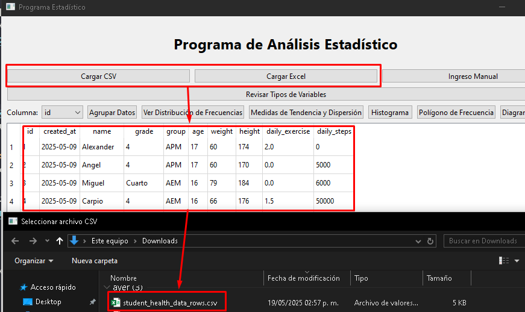
   - Si hay algún error en el archivo, recibo un mensaje claro indicando el problema.

3. **Detección y revisión de tipos de variables**
   - El programa detecta automáticamente si cada columna es cuantitativa (números) o cualitativa (categorías).
   - Puedo revisar y corregir los tipos de variable con un botón dedicado.
   - 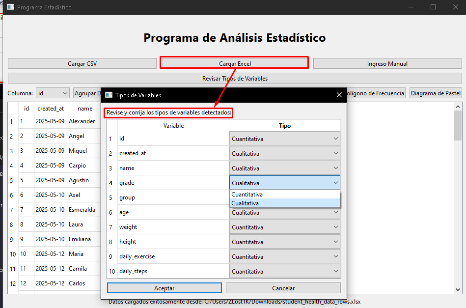

4. **Selección de columna para análisis**
   - Selecciono la columna que quiero analizar desde un menú desplegable.
   - El programa habilita automáticamente las opciones de análisis según el tipo de variable.

5. **Análisis de variables cuantitativas**
   - Si selecciono una variable cuantitativa:
     - Puedo agrupar los datos en intervalos (por ejemplo, usando la regla de Sturges).
     - 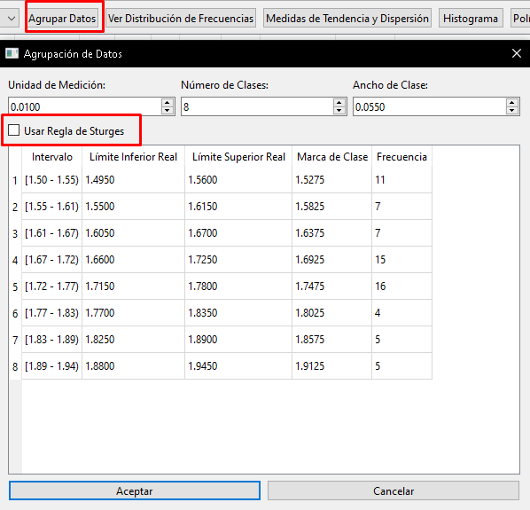
     - Veo la tabla de frecuencias (absoluta, relativa, acumulada, etc.).
     - Se muestran todas las medidas de tendencia central y dispersión: media, mediana, moda, rango, varianza, desviación estándar, desviación media y coeficiente de variación.
     - Cada medida incluye una columna de "sustitución" que muestra cómo se sustituyen los datos en la fórmula. Si hay muchos datos, puedo hacer clic para verlos todos.
     - 
     - Puedo visualizar el histograma y el polígono de frecuencia juntos.
     - 
     - 

6. **Análisis de variables cualitativas**
   - Si selecciono una variable cualitativa:
     - El programa calcula y muestra solo la moda (valor más frecuente) en la tabla de medidas, con su sustitución.
     - El resto de medidas muestran el mensaje "No se puede calcular para variables cualitativas".
     - Veo la tabla de frecuencias por categoría o agrupadas por iniciales si hay muchas categorías.
     - 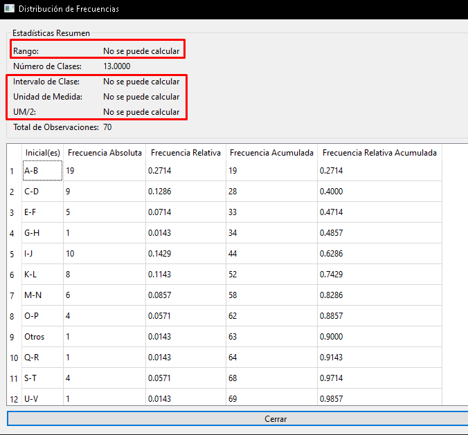
     - Puedo visualizar el diagrama de pastel, el histograma y el polígono de frecuencia para las categorías.
     - 
     - También puedo hacer clic en la sustitución de la moda para ver todos los valores.

7. **Interacción y visualización**
   - Todas las tablas y gráficos se muestran de forma clara y ordenada.
   - Los gráficos se abren en ventanas emergentes y son fáciles de interpretar.
   - Si cambio de columna, el análisis se actualiza automáticamente.

8. **Mensajes y validaciones**
   - Si intento realizar una operación no válida (por ejemplo, una variable cualitativa), el programa me muestra un mensaje de advertencia y no se bloquea.
   - Si hay errores en los datos, siempre recibo mensajes claros y útiles.

9. **Cierre y nuevo análisis**
   - Puedo cargar nuevos datos o cambiar los tipos de variable en cualquier momento.
   - El programa está listo para repetir el análisis con cualquier columna o conjunto de datos.

10. **Crear función entre columnas**
    - Haz clic en **Crear función entre columnas**.
    - Selecciona dos columnas numéricas (X e Y).
    - Elige ajuste automático (mejor grado) o manual (grado polinómico).
    - Visualiza y edita la función ajustada, la tabla de valores y el análisis algebraico.
    - Haz clic en **Sugerir modelo con IA** para obtener una recomendación de Gemini.
    - Guarda el análisis y la sugerencia en Markdown.
    - Puedes graficar los datos y la función ajustada.

---

Este flujo asegura que cualquier usuario, incluso sin experiencia previa en estadística, pueda analizar y visualizar sus datos de manera intuitiva y didáctica, aprovechando todas las funcionalidades del programa.

# Correcciones y mejoras

1. Corrección de la Marca de Clase en la distribución de frecuencias.
    - Este error se debe a que en **el programa solamente mostrábamos 2** decimales en lugar del número completo de decimales esto hacia que **la Clase no coincidiera con la Marca de clase** pero los limites reales si coincidían.
    - Al corregir el error también debemos corregir la precision binaria de los números flotantes en el código.
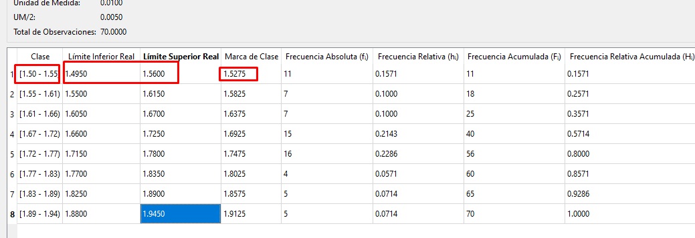
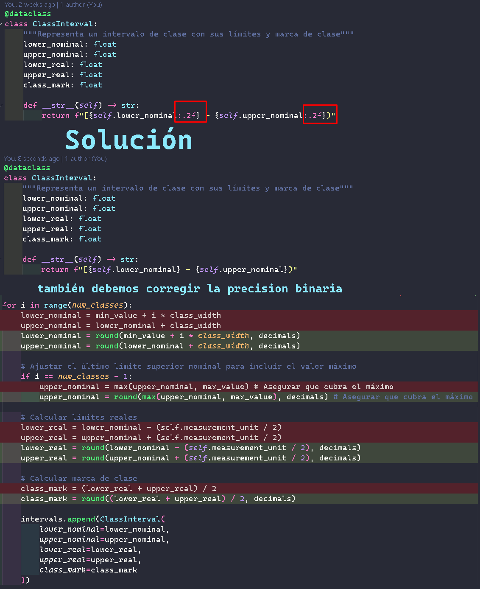